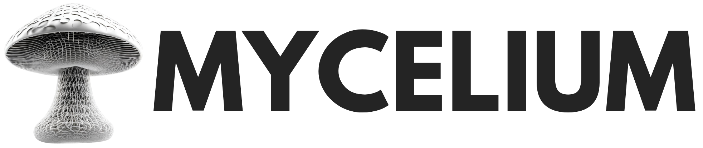

<h1> Mycelium Website </h1>



***

<h2> Table of Contents </h2>

- [Introduction](#introduction)
- [Requirements](#requirements)
- [Contribute to the Website](#contribute-to-the-website)
  - [Fork the Repository](#fork-the-repository)
  - [Clone the Forked Repository](#clone-the-forked-repository)
  - [Build the Website](#build-the-website)
  - [Start the Website](#start-the-website)
  - [Access the Website on a Browser](#access-the-website-on-a-browser)
- [Contact the Website Administrators](#contact-the-website-administrators)
- [Access the Website Online](#access-the-website-online)
- [Steps to Contribute](#steps-to-contribute)

***

## Introduction

The repository contains the official website of **Mycelium** by ThreeFold.

## Requirements

- [Zola](https://www.getzola.org/documentation/getting-started/installation/)

## Contribute to the Website

### Fork the Repository

On the top right corner of the repository page, you will see a button labeled "Fork." Click on it. This action will create a copy of the template repository in your GitHub account.

### Clone the Forked Repository

After forking, go to your GitHub profile, and you should see the forked repository listed there. Click on it. On the right side, you will find a green button labeled "Code." Click on it, and you can either download the repository as a ZIP file or use Git to clone it to your local machine.

To use Git, use this template with your own Github account:

```
git clone https://github.com/YOUR_GITHUB_ACCOUNT/www_mycelium
```

### Build the Website

In the cloned repository directory, build the website:

```
./build.sh
```

### Start the Website

In the cloned repository directory, start the website:

```
./start.sh
```

### Access the Website on a Browser

After running `start.sh`, the script will open a browser on `port 1111`.

The website is available at this URL:

```
http://127.0.0.1:1111/
```

## Contact the Website Administrators

To contact the admins of this website, reach out to Sasha (@sasha-astiadi) and Hassan ( @ehab-hassan).

You can also contact the ThreeFold admins here:
[ThreeFold's Web Admins](https://github.com/orgs/threefoldfoundation/teams/team_web_admin).

## Access the Website Online

For now, the development version of the website is available at this URL: https://www2.mycelium.threefold.io/

Once the website is ready for production, we will share the production URL.

## Steps to Contribute


It is highly important to follow this procedure to contribute to the website content. <br>
__WARNING__: DO NOT commit straight into __master__ / __development__ branch.